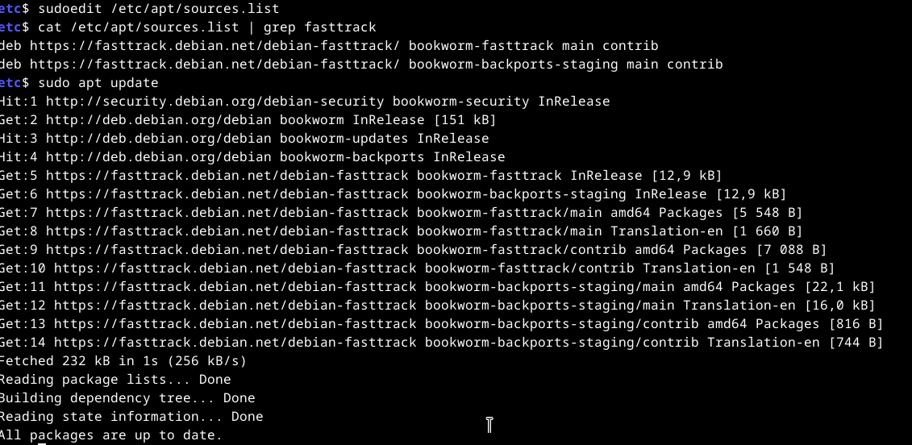

# H2 - Karjaa 
Tehtävänannot luettavissa https://terokarvinen.com/2023/configuration-management-2023-autumn/

## x) Lue ja tiivistä

## a) Vagrantin asennus
Aiemmin olen käyttänyt Linuxia vain virtuaalikoneissa. Edellisellä luennolla mainittiin, että virtuaalikoneiden pyörittäminen sisäkkäin voi aiheuttaa yllättäviä ongelmia. Näiltä välttyäkseni asensin Windowsin rinnalle Debian 12:n. 

Vagrantin asennuksessa seurattu Teron [artikkelin](https://terokarvinen.com/2017/04/11/vagrant-revisited-install-boot-new-virtual-machine-in-31-seconds/) ohjeita. 

Testasin ensin, että Vagrantia ja VirtualBoxia ei ole asennettu. Komentoja ei tunnistettu, eli kumpaakaan ei ollut asennettuna valmiiksi.
    
    ~$ vagrant
    bash: vagrant: command not found
    ~$ virtualbox
    bash: virtualbox: command not found

Vagrantin ja VirtualBoxin asennus:

    $ sudo apt-get update # paketinhallinnan listojen päivitys
    $ sudo apt-get install -y vagrant # vagrantin asennus
    $ sudo apt-get install -y virtualbox # virtualboxin asennus, epäonnistui
    E: Package 'virtualbox' has no installation candidate

VirtualBox ei ollut Debianin käyttämän paketinhallinnan piirissä. Etsin Googlesta asennusohjeita hakusanalla "install virtualbox on debian 12" ja koitin löytää mahdollisimman luotettavan oloisen lähteen, sillä asennus olisi tehtävä paketinhallinan ulkopuolisesta repositoriosta. [wiki.debian.org](https://wiki.debian.org/VirtualBox) vaikutti lupaavalta, joten testasin sieltä löytyvää ohjetta, joka mahdollistaa pakettien asennuksen Debian Fast Trackin kautta.  

### Fast Trackin asennus: 

Aloitin lisäämällä Debian Backportsin paketinhallintaan:

    sources.list.d$ pwd
    /etc/apt/sources.list.d
    sources.list.d$ sudo micro bookworm-backports.list # uusi tiedosto paketinhallinan ulkopuoliselle repositoriolle
    [sudo] password for aatu: 
    sources.list.d$ cat bookworm-backports.list 
    deb http://deb.debian.org/debian bookworm-backports main
    sources.list.d$ sudo apt-get update # paketinhallinnan listan päivitys
    ..
    Hit:4 http://deb.debian.org/debian bookworm-backports InRelease # Ilmeisesti nousi listoille, koska mainitaan updaten yhteydessä
    ..


    $ sudo apt install fasttrack-archive-keyring # fasttrack archiven keyringin asennus

Yritin selvittää, mikä keyringien tarkoitus on. Googlen avulla löysin oikean manpages-sivun: ````$ man apt-secure````, jonka mukaan keyringit ovat osa repositorioiden turvallisen julkaisemisen ketjua.

Lisäsin Fast Trackin paketinhallintaan avaamalla sources.list-tiedoston komennolla ````$ sudoedit /etc/apt/sources.list```` ja lisäämällä sinne seuraavat rivit:


Samassa yhteydessä huomasin, että backports löytyi jo sources.list-tiedostosta, joten poistin aiemmin luomani tiedoston komennolla ````$ sudo rm /etc/apt/sources.list.d/bookwork-backports.list````

Päivitin paketinhallinnan ````$ sudo apt update```` ja kokeilin asentaa VirtualBoxin komennolla ````$ sudo apt install virtualbox````, mutta asennus epäonnistui. Tutkin aiemmin lisäämiäni rivejä kirjoitusvirheiden varalta ja huomasin, että seuraamani ohje oli mahdollisesti tarkoitettu toiselle Debianin versiolle, Bullseyelle. Vaihdoin bullseyen tilalle bookworm, päivitin paketinhallinan ja yritin asennusta uudelleen.



Tämän jälkeen asennus onnistui komennolla ````$ sudo apt install virtualbox````. Lopuksi testasin, että Vagrant ja VirtualBox olivat asentuneet komennoilla ````$ vagrant```` ja ````$ virtualbox````. Vagrant palautti komennon käyttöohjeet ja VirtualBox aukesi, joten asennukset olivat onnistuneet.

## b) Yksi maantiekiertäjä

Loin ensin Vagrantille oman kansion kotihakemistooni ````$ mkdir /home/aatu/Vagrant```` ja ajoin siellä komennon ````$ vagrant init debian/bullseye64````, joka virtuaalikoneen asennukseen käytettävän Vagrantfile-nimisen tiedoston. Pystytin virtuaalikoneen komennolla ````$ vagrant up````. Noin minuutin asennuksen jälkeen vagrant ilmoitti asennuksen onnistuneen ja koneeseen pystyi muodostamaan yhteyden komennolla ````$ vagrant ssh````.


Ajattelin testata nettiyhteyden toimintaa curlilla, mutta sitä ei tullut asennuksen mukana. Google.com vastasi komentoon ````$ ping google.com````, joten virtuaalikoneella oli pääsy internetiin. 


## c) Oma orjansa

Saltista ei ole vielä omaa versiota Debian 12:lle, joten suoritin asennuksen samaan tapaan kuin viime viikolla [terokarvinen.com](https://terokarvinen.com/2023/configuration-management-2023-autumn/)-sivuston H1-osan vinkkiosion ohjeiden mukaisesti. Loin tiedoston salt-asennus.sh, johon syötin seuraavat rivit, minkä jälkeen ajoin tiedoston komennolla ````$ bash salt-asennus.sh````. 

    sudo mkdir /etc/apt/keyrings # ei haittaa vaikka sanoisi etta hakemisto on jo
    sudo curl -fsSL -o /etc/apt/keyrings/salt-archive-keyring-2023.gpg https://repo.saltproject.io/salt/py3/debian/11/amd64/SALT-PROJECT-GPG-PUBKEY-2023.gpg
    echo "deb [signed-by=/etc/apt/keyrings/salt-archive-keyring-2023.gpg arch=amd64] https://repo.saltproject.io/salt/py3/debian/11/amd64/latest bullseye main" | sudo tee /etc/apt/sources.list.d/salt.list
    sudo apt-get update
    sudo apt-get install salt-minion


Testasin orjan asennuksen onnistumisen:

    $ salt-minion --version
    salt-minion 3006.4 (Sulfur) # Versio 3006.4 asennettu

Salt-master piti vielä asentaa. Käytin asennuksessa hyväksi salt-minionin paikallisia komentoja. 

    $ salt-call --local -l info state.single pkg.installed salt-master
    [...]
    Local:
    ----------
          ID: salt-master 
    Function: pkg.installed
      Result: True # toiminnon jälkeen salt-master löytyy
     Comment: The following packages were installed/updated: salt-master # paketti asennettu
     Started: 22:05:19.273632
    Duration: 4399.297 ms
     Changes:   
              ----------
              salt-master:
                  ----------
                  new:
                      3006.4 # asennettu versio
                  old:
                            # ei vanhaa versiota, eli salt-masteria ei aiemmin ollut
    Summary for local
    ------------
    Succeeded: 1 (changed=1) # toiminto onnistunut, yksi muutos kokoonpanoon tehty 
    Failed:    0
    ------------
    Total states run:     1
    Total run time:   4.399 s


Testasin vielä, että salt-master on asentunut komennolla ````$ sudo salt-key````, joka tulostaa listan orjista, jotka ovat tavoitelleet herraa. Lista tulostui ymmärrettävästä syystä vielä tyhjänä, mutta komento kuitenkin toimi. Asennus oli onnistunut. Seuraavaksi jatkoin [Salt Quickstart - Tero Karvinen](https://terokarvinen.com/2018/salt-quickstart-salt-stack-master-and-slave-on-ubuntu-linux/?fromSearch=salt%20master) ohjeen mukaisesti kertomaan orjalle, mistä osoitteesta herraa tulee tavoitella muokkaamalla /etc/salt/minion-tiedostoa. 

    $ hostname -I
    192.168.50.100 # koneen ip-osoite
    $ sudoedit /etc/salt/minion 
    master: 192.168.50.100 # tavoiteltava ip-osoite
    id: kotiorja # orjan nimi 
    $ sudo systemctl restart salt-minion

Orjan tulisi uudelleenkäynnistyksen jälkeen tavoitella herraa, mutta näin ei käynyt. ````$ sudo salt-key```` -listaan ei tulostunut kotiorjaa.


Päätin kokeilla vaihtaa herran ip-osoitteeksi 127.0.0.1, jos se toimisi paremmin. Ei vaikutusta. Käynnistin vielä molemmat demonit uudelleen, minkä jälkeen kotiorja lähti soittelemaan herralle. 

    $ sudo systemctl restart salt-master
    $ sudo systemctl restart salt-minion
    $ sudo salt-key
    Accepted Keys:
    Denied Keys:
    Unaccepted Keys:
    kotiorja # kotiorja yrittänyt yhteyttä, mutta avain hyväksymättä
    Rejected Keys:
    $ sudo salt-key -A # kotiorjan avaimen hyväksyntä
    
    $ sudo salt '*' test.ping # testataan, vastaako orja
    kotiorja:
        True # vastaa, eli toimii


## d) Herra-orja arkkitehtuuri verkon yli

Minulla lojui lähes käyttämättömänä Linoden palvelin, jonka ajattelin soveltuvan hyvin herran tehtäviin. Kävin asentamassa salt-masterin edellisen kohdan mukaisesti ja avasin palomuuriin reiät porteille 4505/tcp ja 4506/tcp komennoilla ````$ sudo ufw allow 4505/tcp```` ja ````$ sudo ufw allow 4506/tcp````. Tämän jälkeen varmistin salt-masterin demonin olevan käynnissä ````$ sudo systemctl restart salt-master````. 

Loin Tero Karvisen [ohjeen](https://terokarvinen.com/2023/salt-vagrant/) mukaisen Vagrantfilen, josta poistin masteriin liittyvät tiedot, koska sellainen pyöri jo vuokratulla palvelimella. Masterin ip-osoitteeksi määritin palvelimen IP-osoitteen. 

Tiedoston sisältö:

    # -*- mode: ruby -*-
    # vi: set ft=ruby :
    # Copyright 2014-2023 Tero Karvinen http://TeroKarvinen.com

    $minion = <<MINION
    sudo apt-get update
    sudo apt-get -qy install salt-minion
    echo "master: xxx.xxx.xxx.xxx">/etc/salt/minion
    sudo service salt-minion restart
    echo "See also: https://terokarvinen.com/2023/salt-vagrant/"
    MINION

    Vagrant.configure("2") do |config|
	    config.vm.box = "debian/bullseye64"

	    config.vm.define "t001" do |t001|
		    t001.vm.provision :shell, inline: $minion
		    t001.vm.network "private_network", ip: "192.168.12.100"
		    t001.vm.hostname = "t001"
	    end

	    config.vm.define "t002" do |t002|
		    t002.vm.provision :shell, inline: $minion
		    t002.vm.network "private_network", ip: "192.168.12.102"
		    t002.vm.hostname = "t002"
	    end
    end


Tämän jälkeen ajoin komennon ````$ vagrant up````, mutta seuraavanlainen virheilmoitus katkaisi prosessin:

    The IP address configured for the host-only network is not within the
    allowed ranges. Please update the address used to be within the allowed
    ranges and run the command again.

      Address: 192.168.12.100
      Ranges: 192.168.56.0/21

Virheilmoitus viittasi minun yrittäneen määrittää osoitteet orjille vääränlaisesta IP-osoiteavaruudesta. Ajoin varmuuden vuoksi komennon ````$ vagrant destroy```` poistaakseni mahdollisesti väärin pystytetyt virtuaalikoneet. Totesin helpommaksi lähestymistavaksi muokata IP-osoitteita kuin käydä etsimässä asetus, josta voin muokata aliverkon peitettä. Kävin laskemassa [IP Subnet Calculatorilla](https://www.calculator.net/ip-subnet-calculator.html?cclass=any&csubnet=21&cip=192.168.56.0&ctype=ipv4&x=Calculate) sopivan osoiteavaruuden ja annoin sieltä IP-osoitteet koneille Vagrantfileen. 


Tämän jälkeen pystytin onnistuneesti koneet komennolla ````$ vagrant up````. Asennuksen valmistuttua kävin tarkistamassa herran puolelta, että orjat olivat yrittäneet tavoitella sitä. 


Orjien avaimet olivat listattuna, eli ne olivat tavoitelleet herraa. Hyväksyin avaimet ja testasin lopuksi, että orjat vastaavat pingiin.

    aatu@localhost:~$ sudo salt '*' test.ping
    t002:
        True 
    t001:
        True

Molemmat vastasivat True, eli linjoilla olivat.


## e) Idempotentit komennot verkon yli

Komensin herran kautta orjia asentamaan Apache2:n. 

	aatu@localhost:~$ sudo salt '*' state.single pkg.installed apache2 enable=True
	t002:
	----------
          ID: apache2
    Function: pkg.installed
      Result: True
     Comment: The following packages were installed/updated: apache2
     Started: 07:16:55.112073
    Duration: 6753.071 ms
     Changes:   
              ----------
              apache2:
                  ----------
                  new:
                      2.4.56-1~deb11u2
                  old:
              apache2-bin:
                  ----------
                  new:
                      2.4.56-1~deb11u2
                  old:
              apache2-data:
                  ----------
                  new:
                      2.4.56-1~deb11u2
                  old:
              apache2-utils:
                  ----------
                  new:
                      2.4.56-1~deb11u2
                  old:
              libapr1:
                  ----------
                  new:
                      1.7.0-6+deb11u2
                  old:
              libaprutil1:
                  ----------
                  new:
                      1.6.1-5+deb11u1
                  old:
              libaprutil1-dbd-sqlite3:
                  ----------
                  new:
                      1.6.1-5+deb11u1
                  old:
              libaprutil1-ldap:
                  ----------
                  new:
                      1.6.1-5+deb11u1
                  old:
              libcurl4:
                  ----------
                  new:
                      7.74.0-1.3+deb11u10
                  old:
              liblua5.3-0:
                  ----------
                  new:
                      5.3.3-1.1+deb11u1
                  old:
              ssl-cert:
                  ----------
                  new:
                      1.1.0+nmu1
                  old:

	Summary for t002
	------------
	Succeeded: 1 (changed=1)
	Failed:    0
	------------
	Total states run:     1
	Total run time:   6.753 s
	t001:
	----------
          ID: apache2
    Function: pkg.installed
      Result: True
     Comment: The following packages were installed/updated: apache2
     Started: 07:16:55.106651
    Duration: 6925.417 ms
     Changes:   
              ----------
              apache2:
                  ----------
                  new:
                      2.4.56-1~deb11u2
                  old:
              apache2-bin:
                  ----------
                  new:
                      2.4.56-1~deb11u2
                  old:
              apache2-data:
                  ----------
                  new:
                      2.4.56-1~deb11u2
                  old:
              apache2-utils:
                  ----------
                  new:
                      2.4.56-1~deb11u2
                  old:
              libapr1:
                  ----------
                  new:
                      1.7.0-6+deb11u2
                  old:
              libaprutil1:
                  ----------
                  new:
                      1.6.1-5+deb11u1
                  old:
              libaprutil1-dbd-sqlite3:
                  ----------
                  new:
                      1.6.1-5+deb11u1
                  old:
              libaprutil1-ldap:
                  ----------
                  new:
                      1.6.1-5+deb11u1
                  old:
              libcurl4:
                  ----------
                  new:
                      7.74.0-1.3+deb11u10
                  old:
              liblua5.3-0:
                  ----------
                  new:
                      5.3.3-1.1+deb11u1
                  old:
              ssl-cert:
                  ----------
                  new:
                      1.1.0+nmu1
                  old:

	Summary for t001
	------------
	Succeeded: 1 (changed=1)
	Failed:    0
	------------
	Total states run:     1
	Total run time:   6.925 s
	aatu@localhost:~$ 

Molemmat orjat ilmoittivat, että toiminto onnistui asentamalla apache2 (packages installed/updated: apache2 / Succeeded: 1 (changed=1)). Saman komennon ajaminen toiseen kertaan palautti orjilta vastauksen (Comment: All specified packages are already installed). Varmistin vielä, että Apache2:n demoni pyörii komennolla ````$ sudo salt '*' state.single service.running apache2````.

		ID: apache2
    	Function: service.running
      	Result: True 
     	Comment: The service apache2 is already running # demoni oli valmiiksi päällä
     	Started: 07:21:44.582546
    	Duration: 27.055 ms
		Changes:   

Päätin korvata Apachen index.html-tiedoston sisällön ja lukea sen catilla. 

	$ sudo salt '*' state.single file.managed /var/www/html/index.html contents="tieto koneen weppi palvelimen etu sivu terve tuloa"
 	$ sudo salt '*' state.single cmd.run 'cat /var/www/html/index.html'


Asensin vielä curlin, varmistin Apachen olevan päällä ja tarkistin, että etusivu oli korvattu uudella sisällöllä.

	$ sudo salt '*' state.single pkg.installed curl # palautti Succeeded 1, changed 1 --> curl asennettu
 	$ sudo salt '*' state.single service.running apache2 # Already running, Succeeded 1 --> Demoni käynnissä
  	$ sudo salt '*' state.single cmd.run 'curl localhost'
   	[...]
                  stdout:
                  tieto koneen weppi palvelimen etu sivu terve tuloa # vastasi odotuksia, tiedoston sisältö korvattu
	[...] 	


## f) Grains

Grains kerää tietoa orjista. Halusin varmistaa, että virtuaalikoneen pystytyksessä määritetyt asetukset vastasivat odotuksia (käyttöjärjestelmä debian/bullseye64, IP-osoitteet samat kuin asetustiedostossa). Minua kiinnosti myös, paljonko keskusmuistia ja prosessorin ytimiä koneille oli annettu käyttöön. Ajoin ensin komennon ````$ sudo salt '*' grains.items````, joka listaa käsittääkseni kaiken grainsilla irti saatavan tiedon orjista. Valitsin näistä itseäni kiinnostavat tiedot erilliseen kyselyyn.


	$ sudo salt '*' grains.item cpu_model num_cpus mem_total lsb_distrib_description osarch ipv4
	t002:
    	----------
    	cpu_model:
        	Intel(R) Core(TM) i7-6700K CPU @ 4.00GHz
    	ipv4:
        	- 10.0.2.15
        	- 127.0.0.1
        	- 192.168.56.3 # IP-osoite vastaa määrityksiä
	
 	lsb_distrib_description:
        Debian GNU/Linux 11 (bullseye) # debian/bullseye64

    	mem_total:
        	461 # 461Mt, ~0.5Gt muistia
    	num_cpus:
        	2 # Kaksi ydintä käytössä
    	osarch:
        	amd64
	t001:
    	----------
	[...]
        	- 192.168.56.2 # IP-osoite vastaa määrityksiä
	[...]


## g) Shell-komento verkon yli


## h) Hello IaC
