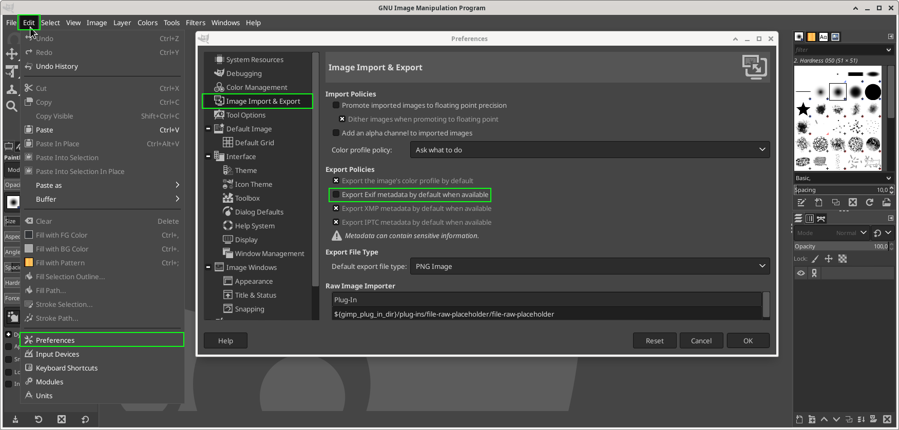

# H5 - CSI Kerava

Tehtävänannot luettavissa: https://terokarvinen.com/2023/configuration-management-2023-autumn/

## x) terokarvinen.com - Apache User Homepages Automatically – Salt Package-File-Service Example

Artikkeli sisältää esimerkkejä demonien konfiguraatiotiedostoista Saltille. Package-file-service on yleisin tapa konfiguroida demoneita.

### Konfiguraatiotiedostojen paikannus

 - Konfiguraatiot tehdään ensin käsin, sitten vasta automatisoidaan.
 - Konfiguraatiotiedostojen paikannus (jos muokkaus tehty esim. graafisesta käyttöliittymästä sudoeditin sijaan): ``$ sudo find -printf '%T+ %p\n | sort``
   - ``$ find`` etsii tiedostoja
   - %T+ tulostaa muokkausajan
   - %p tiedostonimi ja polku
   - \n rivinvaihto
   - sort järjestää tulosteen
     
### Komentojen käyttö Saltin tilan määrittelyssä
 - cmd määriteltävä idempotentiksi konfiguraatiotiedostoissa käytettäessä
   - esim.
     ````
     $ cat /srv/salt/apache/init.sls

     apache2:
       pkg.installed
     /var/www/html/index.html:
       file.managed:
         - source: salt://apache/default-index.html
     a2enmod userdir:
       cmd.run:
         - creates: /etc/apache2/mods-enabled/userdir.conf # Idempotenssi: komento ajetaan, jos tiedostoa ei löydy
     apache2service:
       service.running:
         - name: apache2
         - watch:
           - cmd: 'a2enmod userdir'
     ````
### Tiedostojen hyödyntäminen
 - Esimerkkitiedostojen käyttö on komentojen ajamista luotettavampi tapa määritellä tiloja
 - Edellisen esimerkin toteutus tiedostojen avulla. Kommentit eivät ole artikkelista, vaan omiani.
   ````
   $ cat /srv/salt/apache/default-index.html
   See you at TeroKarvinen.com
   $ cat /srv/salt/apache/init.sls

   apache2:
     pkg.installed # apache2 asennettu
   /var/www/html/index.html: 
     file.managed: # tiedosto /var/www/html/index.html löytyy
       - source: salt://apache/default-index.html # tiedoston sisältö (salt:// = /srv/salt/)
   /etc/apache2/mods-enabled/userdir.conf:
     file.symlink:
       - target: ../mods-available/userdir.conf # symbolinen linkki: userdir.conf -> userdir.load
   /etc/apache2/mods-enabled/userdir.load:
     file.symlink:
       - target: ../mods-available/userdir.load
   apache2service:
     service.running:
       - name: apache2 # apachen demoni päällä
       - watch: # demonin uudelleenkäynnistys, jos listattuja tiedostoja muokataan
         - file: /etc/apache2/mods-enabled/userdir.conf
         - file: /etc/apache2/mods-enabled/userdir.load
   ````

 - Tilojen ajaminen herralta orjille: ``$ sudo salt '*' state.apply apache``
 - Käyttäjien kotisivut ovat kotihakemistojen kansiossa public_html (/$HOME/public_html/)
   - Testaus selaimella: localhost/~käyttäjän_nimi/ (esim. localhost/~aatu/)
   - Hakemiston käyttöoikeudet kuntoon: ``$ chmod ugo+x $HOME/public_html/; chmod ug+r $HOME/public_html/index.html``

Lähde: https://terokarvinen.com/2018/04/03/apache-user-homepages-automatically-salt-package-file-service-example/

## a) CSI Kerava

    Laitteen tiedot:
    OS: Debian 12
    CPU: Intel i7-6700k
    RAM: 32GB
    SSD: 100GB

Aloitin päivittämällä paketinhallinnan listat ja asennetut paketit komennoilla ``$ sudo apt-get update`` & ``$ sudo apt-get upgrade``. Tehtävänannon vinkkiosiota mukaillen ajoin /etc/-hakemiston tiedostojen etsimiseksi komennon ``$ sudo find /etc/ -printf '%T+ %p\n' | sort``.

Komennon tulkinta manpagesia (``$ man find``) hyödyntäen:
 - sudo: seuraavan komennon ajo pääkäyttäjäoikeuksilla. Olen aiemmin findiä käyttäessä huomannut, että kaikkia tiedostoja ei listata käytettäessä ilman sudoa.
 - find: ajettava komento. Find etsii tiedostoja hakemistohierarkiasta.
 - /etc/: hakemisto, josta haetaan
 - printf: findin tulosteen muotoilu
   - %T+: tulostaa tiedoston viimeisen muutoksen aikaleiman (T = aika, + = pvm+aika). Päivämäärä ja aika määräytyvät laitteen aikavyöhykkeen mukaan.
   - %p: tiedoston nimi
   - \n: rivinvaihto. printf ei tulosta rivinvaihtoja automaattisesti, vaan ne tulee lisätä itse.


/etc/-kansion viimeisimmät muokatut tiedostot:

    $ sudo find /etc/ -printf '%T+ %p\n' | sort
    ...
    2023-11-26+20:19:00.8039408450 /etc/default # Tiedostoa /etc/default muokattu 26.11.2023 kello 20:19:00. 
    2023-11-26+20:19:00.8679408450 /etc/kernel/preinst.d
    2023-11-26+20:19:00.9159408460 /etc/modprobe.d
    2023-11-26+20:19:02.1559408530 /etc/gimp/2.0
    2023-11-26+20:19:02.2159408540 /etc/firefox-esr
    2023-11-26+20:19:03.1279408590 /etc/ld.so.cache
    2023-11-26+20:19:04.3919408670 /etc/
    2023-11-26+20:19:04.3919408670 /etc/mailcap


Viimeisimmät muutokset näyttivät olevan hieman aiemmin suoritetun ``$ sudo apt-get upgrade``:n yhteydessä päivitettyjen ohjelmien tiedostoissa. 

Ajoin vielä kotihakemistossa vastaavan komennon ilman sudoa, koska oletin käyttäjän näkevän koko kotihakemistonsa sisällön ilman sudoa. Muistin myös kuulleeni, että sudon käyttö kotihakemistossa ei ole suotavaa. 

    $ pwd
    /home/aatu
    $ find -printf '%T+ %p\n' | sort
    ...
    2023-11-26+20:49:24.1279521710 ./.mozilla/firefox/kkkpuhhe.default-esr
    2023-11-26+20:49:24.1279521710 ./.mozilla/firefox/kkkpuhhe.default-esr/permissions.sqlite
    2023-11-26+20:50:36.6479526210 ./.mozilla/firefox/kkkpuhhe.default-esr/sessionstore-backups/recovery.baklz4
    2023-11-26+20:51:05.3879528000 ./.mozilla/firefox/kkkpuhhe.default-esr/sessionstore-backups
    2023-11-26+20:51:05.3879528000 ./.mozilla/firefox/kkkpuhhe.default-esr/sessionstore-backups/recovery.jsonlz4

Kotihakemiston tuoreimmat muokatut tiedostot liittyivät kaikki Firefoxiin, jolla selasin tehtävänantoa ja Githubia.


## b) Gui2fs

Ajattelin muokata jonkin sellaisen ohjelman asetuksia, joka ei raporttia kirjoitellessa ollut jo valmiiksi käytössä. Hetken Applications-listaa selattuani valitsin uhriksi GIMPin. (Applications -> Graphics -> Gnu Image Manipulation Program). GIMPin navigointipalkista valitsin Edit -> Preferences päästäkseni asetuksiin, josta kävin poistamassa Exif metadatan lisäämisen kuviin (Image import & Export -> [ ] Export Exif metadata by default when available).


> GIMPin asetukset ja tehty muutos

Seuraavaksi piti löytää tiedosto, johon muutos kirjoitettiin. Heti asetuksen muokkauksen jälkeen siirryin juurihakemistoon ``$ cd /``ja ajoin siellä komennon ``$ sudo find -printf '%T+ %p\n' | grep gimp | sort``, joka etsii pääkäyttäjäoikeuksilla tiedostojärjestelmän kaikkien tiedostojen muokkausajat ja sijainnit, listaa vain sanan 'gimp' sisältävät osumat ja järjestää listan. Tuorein muokattu tiedosto oli ``/home/aatu/.config/GIMP/2.10/gimprc``. Muutos oli ilmeisesti  vain käyttäjäkohtainen, koska asetus tallennettiin käyttäjän kotihakemistoon, eikä /etc/:n alle. 

Tarkistin vielä tiedoston sisällön varmistuakseni löytäneeni oikean tiedoston:

    /$ cat /home/aatu/.config/GIMP/2.10/gimprc
    # GIMP gimprc
    ...
    (export-metadata-exif no) # muokattu asetus
    ...
    # end of gimprc

## c) Komennus


